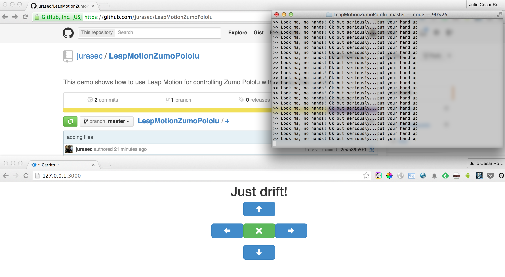

#LeapMotionZumoPololu


This demo shows how to use Leap Moting for controlling the Zumo Pololu using Johnny Five


## Setup

Cloning repo

```bash
$ git clone https://github.com/jurasec/LeapMotionZumoPololu
```

Installing dependencies

```bash
$ cd LeapMotionZumoPololu && npm install
````

Screen demo

